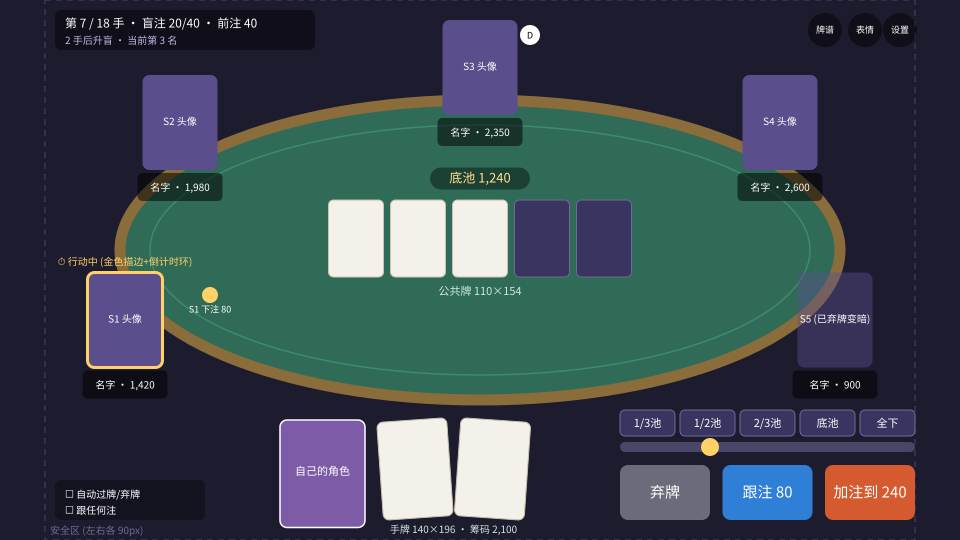

# 03 · 2D 还是 3D、界面布局、演出规范

## 1. 结论：纯 2D（加一点 2.5D 手法），横屏

| 维度 | 2D | 3D |
|---|---|---|
| 卖点是**角色** | 立绘、Live2D 天生是 2D | 3D 角色建模成本高一个数量级，二次元味也难做 |
| **美术来源是 AI** | AI 出图直接就是 2D 素材 | AI 出不了可用的 3D 模型和动作 |
| 牌桌上的物体 | 扑克和筹码本来就是扁的 | 雀魂用 3D 是因为麻将牌有厚度、有牌山，德扑不需要 |
| 手机性能和包体 | 轻 | 重 |
| 开发成本（小团队） | 低 | 高 |

**所以选 2D。** 想要的"立体感"用这些 2.5D 手法实现：
- 牌桌背景画成带透视的（美术画出来，不是 3D 渲染）
- 翻牌用着色器做伪 3D 翻转（缩放 X 轴加斜切加高光扫过）
- 2D 摄像机做推近、震动、慢动作（全下摊牌时用）
- 粒子特效：筹码飞入、大牌金光、淘汰碎裂

**横屏 16:9。** 理由：雀魂是横屏；PC（Steam）天然横屏；6 个座位围一张椭圆桌，横屏空间最舒服；角色切入图需要宽画幅。

## 2. 界面布局（设计分辨率 1920×1080）

### 2.1 区域与坐标

| 区域 | 位置（中心点或范围） | 尺寸 | 说明 |
|---|---|---|---|
| 牌桌 | 中心 (960, 500) | 椭圆 1440×600 | 毡布颜色可以换皮肤 |
| 公共牌 | y=400 起，水平居中 | 每张 110×154，间距 14 | 未发的位置显示淡色占位 |
| 底池 | (960, 357) | 胶囊 200×44 | 有边池时并排显示多个 |
| **自己：角色** | (645, 948) | 170×215 | 自己角色的头像，表情会随结果变 |
| **自己：手牌** | (907, 938) | 每张 140×196，左右各倾斜 4° | 永远是屏幕上最大的牌 |
| S1 左下 | (250, 640) | 头像 150×190 + 名牌 170×56 | 座位按**顺时针**排列：自己的下一位在左边 |
| S2 左上 | (360, 245) | 同上 | |
| S3 正上 | (960, 135) | 同上 | |
| S4 右上 | (1560, 245) | 同上 | |
| S5 右下 | (1670, 640) | 同上 | |
| 下注筹码 | 座位到桌心连线的 30% 处 | | 每条街结束后飞向底池 |
| 庄家按钮 D | 庄家头像右上角 | 直径 40 | 每手开始时滑动到新位置 |
| 操作区 | 右下 x 1240~1830, y 820~1040 | 主按钮 180×110 | 见 2.2 |
| 预操作 | 左下 (110, 960) | | "自动过牌或弃牌"、"跟任何注" |
| 顶部 HUD | 左上 | | 第几手、盲注和前注、几手后升盲、当前名次 |
| 功能按钮 | 右上 | 直径 68 | 牌谱、表情、设置 |
| 安全区 | 左右各 90px | | 刘海屏手机上不放可交互元素 |

**状态表现：**
- 正在行动：头像金色描边，外加一圈倒计时环（最后 5 秒变红并发出提示音）
- 已弃牌：头像变暗到 45%，手牌背面收走
- 全下：名牌上出现"ALL IN"标签，筹码数显示为 0
- 被淘汰：头像变成灰色剪影，显示名次（"第 6 名"）

### 2.2 操作区

- **三个主按钮**：弃牌（灰）、过牌或跟注（蓝，显示金额）、下注或加注（橙，显示"加注到 X"）。只有一个选项时（例如只能全下）就合并。
- **快捷下注**：
  - 翻牌前按大盲倍数：2x、2.5x、3x、全下
  - 翻牌后按底池比例：1/3 池、1/2 池、2/3 池、底池、全下
- **滑条**：拖动选择任意额度，自动吸附到小盲的整数倍
- **手机端**：按钮都在右手拇指区；滑条可以左右拖，也可以上下拖
- **行动时间**：每步 15 秒，另有每局 30 秒的时间银行（快速赛的建议值，以试玩数据为准）

## 3. 演出规范

### 3.1 四条铁律

1. **演出不能泄露信息。** 所有演出只能由**公开事件**触发。角色**绝不能**因为自己手牌好而露出开心表情；诈唬时和拿强牌时，下注台词必须从**同一个台词池**里随机抽。否则演出就成了"读牌器"，竞技公平性直接崩掉。
2. **演出不能拖节奏。** 0 级和 1 级演出与下一位玩家的行动**并行**，不暂停计时。2 级和 3 级会暂停计时，但有时长上限。4 级很稀有。
3. **都能简化或关闭。** 设置里有"完整、简略、关闭"三档。简略模式只保留 0 级和 3 级。
4. **第一次看完整，以后可以跳过。** 某个角色的某段大演出第一次触发时完整播放；之后点击就能跳过。

### 3.2 演出分级

| 级别 | 触发（引擎事件） | 时长 | 暂停计时？ | 内容 |
|---|---|---|---|---|
| **0 · 基础反馈** | 每个 `Act`、`BoardDealt`、`PostBlind`、`WinPot` | ≤0.3 秒 | 否 | 筹码滑动、发牌、按钮高亮、音效 |
| **1 · 角色反应** | 加注、大额跟注（大于等于底池一半）、弃牌（低频） | 0.5~1 秒 | 否 | 头像表情变化 + 气泡台词 + 短语音（约 30% 概率，同一角色 3 手内不重复） |
| **2 · 全下切入** | `Act` 且 allIn=true | 约 1.2 秒 | 是（最多 1.2 秒） | 斜向色带里角色半身像切入、"ALL IN"大字、专属语音。每人每手最多一次 |
| **3 · 全下摊牌** | `AllInRunout` | 3~5 秒 | 是 | 所有人同时亮牌，**显示胜率百分比**，剩下的公共牌一张一张慢放，河牌推近镜头加心跳音效 |
| **4 · 大牌终结** | 摊牌赢下底池，并且牌型是四条或同花顺（皇家同花顺用专属版本） | 约 2.5 秒 | 是，可跳过 | 全屏角色专属立绘、牌型名书法大字（如"皇家同花顺"），相当于麻将的役满 |
| 结算 | 比赛结束 | 4~6 秒 | — | 名次榜、第 1 名胜利立绘和语音、段位分增减动画 |
| 淘汰 | 筹码归零 | 约 1 秒 | 否 | 头像碎裂成剪影、淘汰台词、显示名次 |

> 和 Poker Chase 的区别：它每次摊牌都有切入；我们普通摊牌只用 0 级演出（亮牌加高亮最佳 5 张），**只有全下、大牌、淘汰、结算才有大演出**。少，才显得珍贵。

### 3.3 引擎事件和演出的对应

规则引擎按顺序输出 `Event`，客户端按顺序播放，并且只播放 `visibleTo` 允许的事件：

| Event | 演出 |
|---|---|
| `HandStarted` | 庄家按钮滑动，洗牌音效 |
| `PostSmallBlind` / `PostBigBlind` / `PostAnte` | 筹码从座位滑到下注区 |
| `DealHole` | 发牌动画（自己的牌翻开，别人的保持背面） |
| `Act` | 0 级 + 可能的 1 级；allIn 时触发 2 级 |
| `BoardDealt` | 翻牌三张依次翻开，转牌和河牌单张翻开 |
| `UncalledReturn` | 多出的筹码飞回座位 |
| `AllInRunout` | 进入 3 级演出 |
| `ShowCards` | 亮牌，高亮组成最佳牌型的 5 张 |
| `WinPot` | 筹码飞向赢家（有边池时分批飞）；满足条件时触发 4 级 |
| `HandEnded` | 清理桌面；如果有人筹码归零，播放淘汰演出 |

### 3.4 每个角色的最小台词集（MVP）

| 类别 | 条数 | 例 |
|---|---|---|
| 入座、开局 | 2 | "今天手气应该不错。" |
| 加注、下注（**强牌和诈唬共用**） | 4 | "就这么定了。" |
| 跟注 | 2 | |
| 全下 | 2 | |
| 赢下底池 | 3 | |
| 输掉大底池 | 2 | |
| 大牌（四条和同花顺） | 1 | |
| 淘汰 | 1 | |
| 第 1 名 | 1 | |
| 第 6 名 | 1 | |
| **合计** | **约 19 条** | 每个角色 |

### 3.5 AI 美术需求清单（每个角色）

| 素材 | 规格 | 用途 |
|---|---|---|
| 头像（三种表情：普通、开心、沮丧） | 512×640，透明背景 | 座位 |
| 半身切入图 | 1200×1600，透明背景 | 2 级全下切入 |
| 胜利立绘 | 1920×1080 | 4 级演出和结算 |

另外需要：牌桌毡布、牌背、扑克牌面（建议程序化排版：四种花色图标加字体）、筹码、界面框体。

**AI 出图的规范：** 固定同一个模型或 LoRA 和同一套提示词模板，保证所有角色画风统一；每个角色先出一张三视图设定稿，后续素材都参照它；在 Steam 页面如实披露 AI 生成内容；正式上线前主要立绘换成画师作品（见 [01](01-market-research.md) 第 3 节）。
