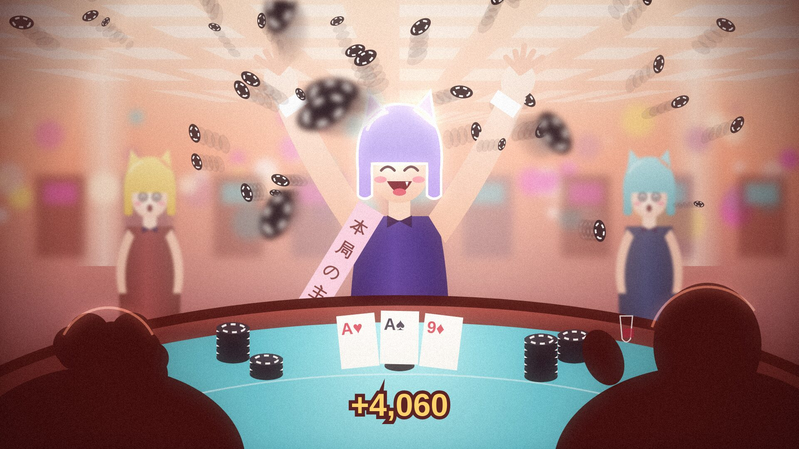
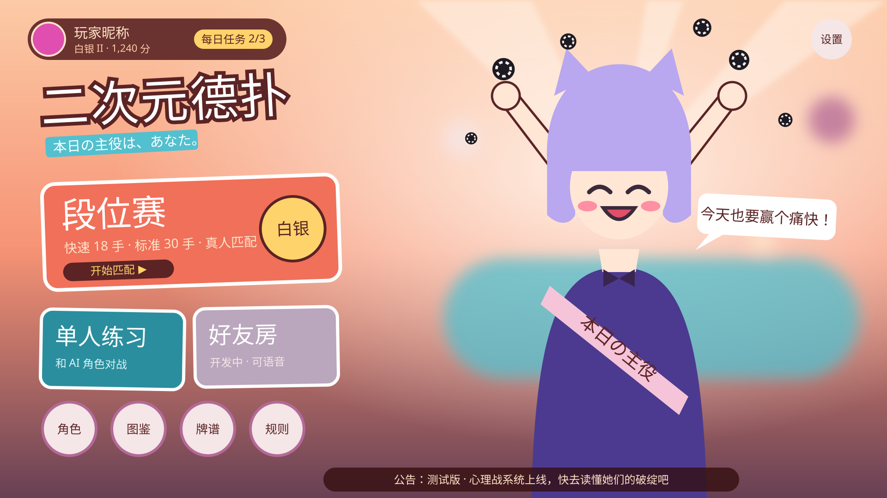

# 07 · 美术方向提案（v2，已被取代）

> **已被 [10 美术方向 v3：「牌面」](10-art-direction-v2.md) 取代**：目标平台改为 Steam，界面改成从扑克牌里长出来的「牌面」风格，角色走精致、性感的成人向二次元。本文的构图分析、2D 分层和第一人称牌桌的结论仍然有效。

> 参考图：一张暖光赌场里、角色赢下大局后站上桌子振臂欢呼、筹码漫天飞的厚涂插画。下面是从它提炼出的美术方向，以及它落到游戏里的样子。
> 线框图里的人物都是占位剪影，只用来看**构图和配色**，不代表最终画风。

*v3 关键帧（代码绘制，`art/keyframe-v3.html`）：验证构图和光影能带来多少冲击力。人物仍是占位画，最终要换成插画。*

## 1. 这张参考图为什么好看

| 要素 | 参考图的做法 | 对我们的意义 |
|---|---|---|
| **构图** | 低机位、广角透视，从玩家背后看向牌桌；前景的人物剪影把画面框住；顶灯的线条全部汇聚到中央的赢家 | 牌桌不该是"俯视的棋盘"，而是"你坐在桌前"，视线被引向主角 |
| **光** | 暖色顶光、灯带、整体高调明亮，有泛光和漏光，背景虚化 | 热闹、喧闹的赌场气氛；现在的暗紫色界面正好相反 |
| **色** | 大面积暖珊瑚、桃色，阴影用酒红；**青绿牌桌是唯一的冷色**（只占约 2.5% 面积），视线自动落在桌上；紫色和粉色的角色从暖色背景里跳出来 | 色彩比例比颜色本身更重要，见第 2 节 |
| **笔触** | 厚涂，笔触松弛、有颗粒感，边缘不是干净的赛璐璐线 | 一眼就和廉价手游拉开差距 |
| **情绪** | 一个高光瞬间：赢家闭眼大笑、露出虎牙、腮红，张开双臂；筹码飞起来；周围的大叔目瞪口呆 | 这正是我们"大底池获胜"该有的样子 |
| **角色设计** | 波波头加兽耳般的发型、绷带、手腕袖口、蝴蝶结；剪影简单、识别度高；每个角色有自己的主色 | 角色要做到"缩成小头像也认得出来" |
| **道具幽默** | "本日の主役"绶带 | 可以直接做成游戏里的"本局主役"标识 |

## 2. 色板

从参考图直接提取，按用途和面积比例分配：

| 用途 | 颜色 | 约占画面 |
|---|---|---|
| 环境暖光 | 桃 `#FCCAA6` · 珊瑚 `#F69375` · 鲑红 `#EFA497` · 粉白 `#F5E6E7` | **60%** |
| 阴影和深色文字 | 酒红 `#5B2324` · 深褐红 `#300B0B` · 李紫 `#684054` · 灰玫 `#9E595E` | 20% |
| 角色强调色 | 紫 `#4B3A8F` · 薰衣草 `#B9A7F0` · 洋红 `#E04FB0` · 藕紫 `#BAA6BD` | 10% |
| **牌桌（唯一冷色）** | 青绿 `#52C0CF` · 深青 `#2A8E9E` | 7% |
| 筹码和点缀 | 筹码黑 `#1E1A22` · 筹码白 `#F7F2EE` · 金 `#FFD36B` | 3% |

**规则：** 冷色只给牌桌，以及"跟注"这类和牌桌有关的按钮；界面上的大块面都用暖色或纸白，不再用深色玻璃面板。

## 3. 用不用 three.js 做 3D？结论：不用，做 2D 分层（2.5D）

| | 2D 分层（PixiJS，现有） | three.js 3D 建模 |
|---|---|---|
| 能不能做出参考图的画感 | ✅ 厚涂插画直接用 | ❌ 三渲二也做不出厚涂笔触 |
| 美术来源 | AI 出图或画师绘制，都是 2D | 需要 3D 建模、绑定骨骼、做动作，成本高一个数量级 |
| 立体感 | 画出来的透视背景板 + 视差分层 + 镜头推拉 + 粒子 | 真 3D |
| 手机性能、包体 | 轻 | 重 |

需要的"空间感"全部可以用 2D 实现：
- **背景板**：赌场内景按远、中、近分 3 层，鼠标或手机陀螺仪轻微视差。
- **牌桌**：透视的青绿桌面，公共牌、筹码按透视缩放。
- **镜头**：全下、河牌、获胜时推近和轻微摇晃（现在已经有）。
- **粒子**：筹码飞溅和雨落、彩带、泛光。

以后如果想要筹码的真实物理效果，可以只在那一层叠加一个小的 3D 场景，不影响整体。

## 4. 牌桌：从"俯视棋盘"改成"坐在桌前"

见上面第一张线框图：
- **镜头**在你的座位上，略高于桌面。青绿桌面占画面下方一半，近处出画，远边是一条弧线。
- **5 个对手**坐在牌桌远侧，用**半身立绘**（腰部以上，被桌沿挡住下半身）。两边的离你近，画得大一些；中间的远，画得小一些。这样立绘成了画面主体，而现在只是小方块头像。
- **名牌**像纸片一样贴在每个人面前的桌沿上（带胶带），显示名字和筹码。下注的筹码按透视放在她们面前。
- **公共牌**透视摆在桌面中央，底池的黑白筹码堆在旁边。
- **你的手牌**在前景，大而倾斜，下半截出画，就像真的拿在手里。
- **你的角色**像雀魂一样，在左下角探出半身。台词、表情入口收成两个圆按钮放在旁边。
- **操作按钮**像彩票或筹码一样，带白色贴纸描边、略微倾斜：弃牌是酒红，跟注是青绿，加注是珊瑚。
- **立绘会动**：
  - 轮到谁谁就微微前倾、高亮。
  - 弃牌时变暗、往后靠。
  - 表情由引擎事件驱动，切换平常、得意、紧张、生气。

## 5. 高光时刻："本局主役"

参考图本身就是这一刻。当有人赢下大底池或全下获胜时：
1. 镜头推向赢家，背景泛起暖光。
2. 赢家切换成**全身胜利立绘**：从座位上站起、张开双臂，身上出现"本局主役"绶带。
3. 筹码从桌面爆开飞起，再像雨一样落下。
4. 其他角色同时切换成震惊或沮丧的表情。
5. 持续约 2.5 秒，点击可以跳过。

这一刻取代现在的金色 WIN 色带。普通的小胜利还是保持轻量（表情包和一句台词）。

## 6. 主页

见上面第二张线框图：
- 背景是暖光赌场大厅，**看板角色**（玩家选的角色）站在右侧。她会呼吸、眨眼，点她会换一句台词；筹码在她头顶飞。
- 左侧是标题和模式入口，像贴在墙上的海报：
  - **段位赛**：最大的卡片，显示当前段位。
  - **单人练习**。
  - **好友房**：标"开发中"。
  - 下面一排小圆按钮：角色、图鉴、牌谱、规则。
- 顶栏显示玩家昵称、段位和分数、每日任务；右上角是设置；底部是公告条。
- 点"段位赛"进入二级页选择快速赛或标准赛，然后进入匹配。

## 7. 界面风格

- **材质**：纸片、贴纸、胶带，取代现在的深色玻璃面板。卡片用粉白底、酒红字，粗白边，轻微倾斜。
- **字体**（都在 Google Fonts，可以直接用）：
  - 标题和大字：**站酷庆科黄油体**（ZCOOL QingKe HuangYou），圆胖、有活力。
  - 正文：**Noto Sans SC**。
  - 数字、英文（ALL IN、WIN）：**Dela Gothic One**。
- **动效**：卡片弹跳出现，按钮按下有回弹，筹码和数字滚动；动作要有"手感"，但不拖慢节奏。

## 8. 角色和 AI 出图规范

### 每个角色需要的素材

| 素材 | 规格 | 用途 |
|---|---|---|
| 半身立绘 × 4 种表情（平常、得意、紧张、生气） | 1200×1600，透明背景，腰部以上 | 牌桌座位 |
| 全身胜利立绘 | 1600×2000，透明背景 | 本局主役、主页看板 |
| 震惊和哭的半身 | 同半身规格 | 摊牌反应 |
| 表情包 × 8 | 512×512 | 心理战 |

**角色设计要求**：
- 每人一个主色（对应现在的 6 个性格）。
- 剪影要有特征（发型、耳朵、配饰），缩成头像也能认出来。
- 统一的"赌场工作服"体系，各自有变化（领结、袖口、绶带、绷带等小道具）。

### 场景素材

- **牌桌场景背景**（不含桌子）：3840×2160，暖光赌场内景，分远景人群和灯、中景柱子、近景顶灯 3 层。
- **主页大厅背景**：3840×2160。

### AI 出图提示词模板

> 关键词示例（英文，适用于大多数出图工具）：
> `anime girl, half body, casino staff outfit, painterly, thick paint, loose brush strokes, warm coral and peach lighting, high key, bloom, light leaks, blurred casino background, expressive face, fang, blush, bob haircut, (角色主色) hair, transparent background`
>
> 负面词：`3d, photorealistic, flat cel shading, heavy lineart, text, watermark, signature, cash, banknotes`

要点：
- 固定同一个模型、同一套风格词和同一个随机种子范围，先给每个角色出一张三视图设定稿，后续素材都参照它，保证画风统一。
- **参考图只用来定方向，不直接使用或描摹原图**：原图有作者签名，有版权。
- 负面词里排除钞票。我们的合规红线是不出现真钱元素（见 [01](01-market-research.md)），参考图里的美元钞票不能出现在游戏里。
- 服装尺度会影响年龄分级和商店审核；赌场兔女郎类服装要把握分寸，这一点等定角色时一起定。

## 9. 冲击力从哪来（v2 线框图的教训）

v2 线框图的位置和配色都对，但"没有一眼抓住人的感觉"。对照参考图，缺的是下面这些，v3 关键帧逐条补上了：

| 手法 | v2 | v3 和游戏里的做法 |
|---|---|---|
| **一个绝对主角** | 五个人一样大、一样亮、一样的表情 | 主角最大、最亮、有逆光勾边；其他人退后、虚化、表情是陪衬（震惊） |
| **前景框景** | 没有前景 | 前景是深色的观众背影，压住四角 |
| **景深** | 所有东西一样清晰 | 远景虚化；近处飞过的筹码大而模糊 |
| **动感** | 静止 | 筹码带运动模糊爆开，人物张开双臂 |
| **透视和机位** | 平视、对称 | 低机位，顶灯线条汇聚到主角头顶 |
| **光和空气** | 平涂渐变 | 中心暖光、泛光、薄雾、暗角、胶片颗粒、整体暖色调 |
| **人物绘制** | 矢量色块 | **代码做不到**：体积、厚涂笔触、手和表情的细节必须来自插画 |

**落到游戏里的原则：平时克制，关键时刻爆发。**
- **平时**：画面要清楚好读。仍然保留前景框景、景深、暖光和颗粒，但不加特效。正在行动的人提亮、对焦，其他人略微压暗、虚化，视线始终跟着行动的人走。
- **关键时刻**：全下、摊牌、本局主役时，镜头推近，筹码爆开，泛光增强，其他角色切换反应表情，用上全套手法。
- **技术上**：PixiJS 的滤镜（模糊、泛光、颗粒、调色）都能实时实现，不需要 3D。

**结论：** 构图和光影由我在代码里实现，能把冲击力拉到 v3 的程度。剩下最关键的那一步，人物的绘制质量，必须靠插画素材（AI 出图或画师）。

## 10. 实施步骤

1. **先换"骨架"**（不依赖新美术，我可以马上做）：
   - 新的主页。
   - 第一人称牌桌布局。
   - 暖色色板、纸片和贴纸界面、新字体。
   - 本局主役演出的动画框架。
   - 角色先用新风格的占位剪影。
2. **出角色设定**：6 个角色的名字、外形、主色、性格，和现在的 AI 性格对应。
3. **AI 出图**：按第 8 节的规范批量出素材，放进约定好的目录，游戏自动读取。
4. **Live2D 和语音**：放到角色定稿之后。
