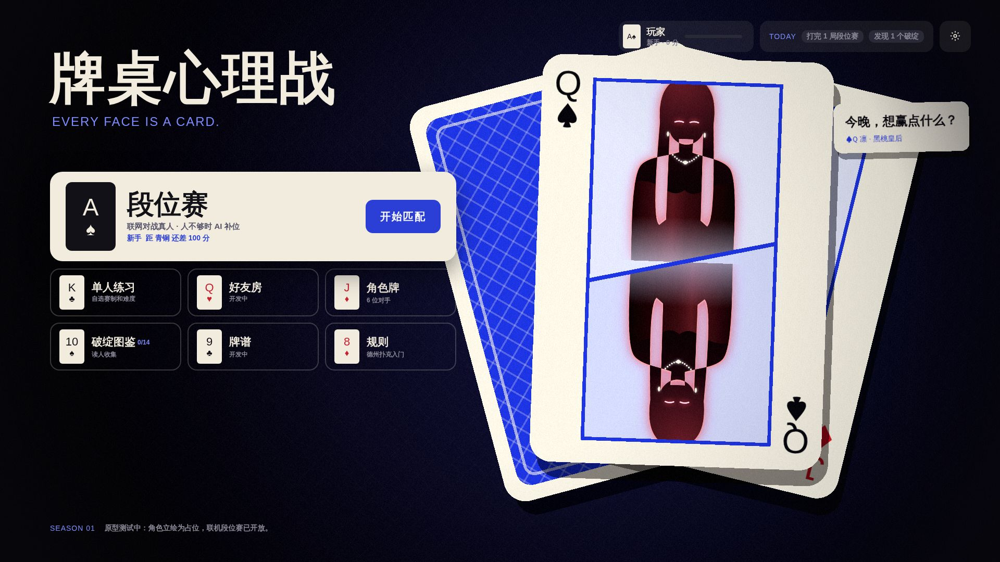
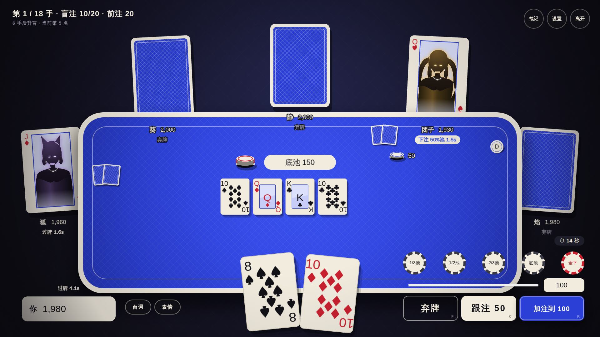

# 10 · 美术方向 v3：「牌面」

> 定位：**上 Steam，对标雀魂**。精致、性感的成人向二次元，但界面**不靠金色和花纹堆"奢华"**，而是从一副扑克牌里长出来：牌面、牌背、筹码、人头牌。
> 演变：v2「皇家之夜」（酒红 + 金色赌场）被否定，原因是太油腻；之后试过「红与黑」，又太像《女神异闻录5》。最后在[设计板](https://claude.ai/artifact/Q62H2WrXBS4rpJz7AL4EUD)上选定「牌面」。设计板的「牌面 · 细化」页是这份文档的视觉版本。
> 07 的构图分析和 2D 分层结论仍然有效；素材路径和热插拔规范见 [08 第 6 节](08-presentation.md)。





*现在的主页和牌桌（全部代码绘制，没有外部素材）。人物还是剪影占位，AI 立绘到位后会自动替换进角色牌。*

## 1. 一句话风格

**"每张脸都是一张牌"**：每个角色都是一张人头牌，牌桌是一张大牌背，按钮是筹码，状态切换就是翻牌。

| 不要 | 要 |
|---|---|
| 金色、花纹、发光描边、水晶灯（"油腻"） | 墨黑、钴蓝、象牙三色，大面积留白 |
| 斜切、网点、红黑大色块（像 P5） | 扑克牌的圆角、牌角索引、中心对称的人头牌构图 |
| 衬线体、毛笔字 | 思源黑体 Heavy + Archivo Black（宽体，像牌角的字） |
| 校服、学生、萝莉体型 | 明确的成年女性：晚礼服、丝绒、蕾丝、珠宝 |

**这套语言为什么好**：只有扑克游戏能用，别人抄不走；而且角色牌、牌背、牌面皮肤天然就是收集要素和收入点。

## 2. 色板

代码里的定义在 `web/src/stage/painter.ts` 的 `PAL` 和 `web/src/style.css` 的 `:root`。

| 名称 | 色值 | 用在哪 | 面积 |
|---|---|---|---|
| 墨黑 ink | `#121117`（亮一档 `#1e1d2a`） | 底色、深色面板 | 约 55% |
| 牌背钴蓝 cobalt | `#2b3fd6`（浅 `#7c8cff`、淡 `#dce0fa`） | 牌桌、牌背、主按钮、大时刻的底 | 约 25% |
| 牌面象牙 ivory | `#f2ecdf` | 牌、浮层面板、文字 | 约 17% |
| 牌红 red | `#c8202f` | **只给**红心、方块、"全下"、ALL IN 和警示 | 约 3% |
| 角色主色 | 每人一个 | 立绘的轮廓光、台词气泡的小色条 | 点缀 |

## 3. 牌和人头牌

- **人头牌**（`web/src/stage/court.ts`）：象牙底、牌角索引（点数 + 花色，对角倒置再印一次）、钴蓝框里放立绘。
  - 牌桌上的座位牌：一张正立的半身像。
  - 大时刻（ALL IN、对决、主页看板）：经典人头牌构图——上半身正立，下半张同一张图旋转 180°，中间一条斜分界线。
- **每个角色对应一张牌**：凛 ♠Q · 静 ♣Q · 葵 ♦Q · 团子 ♥Q · 焰 ♥J · 狐 ♦J · 你 ♠A（`characters.ts` 的 `court` 字段）。
- **牌背**：钴蓝菱格 + 象牙边 + 内框线。牌桌、弃牌的座位牌、结算里出局的人、未发现的破绽都用它。
- **筹码**：象牙底配钴蓝或红色边点；下注额度按钮也做成筹码。

## 4. 界面和动效

- **字体**：中文只用思源黑体（标题 900、按钮 700、正文 400）；数字、牌点、英文用 Archivo Black。
- **面板**：象牙卡片（圆角 16–28px）+ 墨黑文字；对话框左上和右下角印着 "A♠" 牌角。
- **按钮**：弃牌（象牙描边）、跟注（象牙底）、加注（钴蓝底）；额度按钮是筹码。
- **座位状态**：正在行动的牌会立起来，并加一圈浅钴蓝描边；弃牌翻到背面；全下时红边闪烁；出局后翻到背面并盖上 "OUT" 章。
- **动效四个词**：发（从牌堆飞出带旋转）、翻（状态切换）、展（扇形展开）、洗（换场景）。
- **大时刻**：
  - ALL IN：全屏变成牌背，她的人头牌被发进画面，旁边是 "ALL IN." 和下注额，再加一张台词卡。
  - 对决：两张人头牌从两侧发进来，"VS" 印在中间的一枚大筹码上。
  - 诈唬亮牌：她的牌翻过来是一张**鬼牌（JOKER）**，正中印着"诈唬"。
  - 本局主役：赢家的牌立起来放大，再挂上一条象牙色绶带。

## 5. 角色：性感但安全

性感是核心卖点，但 Steam 审核、年龄分级、以后进其他平台都要考虑。**原则：靠气质、姿态、光影和服装剪裁出效果，不靠裸露。**

### 硬性要求

1. **所有角色明确是成年人**：设定年龄 23 岁以上，成年女性的身材比例和面部，场景是成人赌场。不用校服、书包、童装元素，不画幼态的体型和脸。这一条没有商量余地——它决定能不能上架，也是底线。
2. **不露点、不画性行为**。深 V、露背、高开衩、丝袜、吊带袜、兔女郎式荷官服都可以；内衣外露和走光镜头不做。
3. **不出现真钱**：没有钞票、没有货币符号（见 [01](01-market-research.md)）。

### 怎么做出"血脉喷张"

| 手段 | 例子 |
|---|---|
| **剪裁** | 露背晚礼服、侧开衩到大腿、一字肩、深 V、紧身缎面、长手套 |
| **材质** | 丝绒、缎面高光、黑色蕾丝、透纱袖、丝袜光泽、珠宝反光 |
| **姿态** | 侧身回眸、托腮、手指绕发、倚着牌桌俯身、指尖夹筹码、叠腿 |
| **表情** | 半闭眼、挑眉、咬唇、居高临下的微笑；输了是不甘而不是哭哭啼啼 |
| **光** | 轮廓光勾锁骨、肩线和腰线；脸一半在阴影里 |
| **演出** | 赢的时候站起来、撩头发；ALL IN 切入时的眼神特写；本局主役的胜利全身立绘是全游戏最"杀"的一张 |

### 六个角色的造型方向

剪影已经在游戏里（发型对应 `web/src/stage/assets.ts` 的 `HAIR`），立绘要和剪影一致；放进人头牌的窄框里、缩成头像也要能认出来。首饰建议用珍珠和银，和界面的象牙、钴蓝更搭。

| 角色 | 牌 | 性格 | 主色 | 造型方向 |
|---|---|---|---|---|
| 凛 | ♠Q | 紧凶型 | 绯红 | 黑长直、冷艳。绯红露背缎面长裙、黑色长手套、红唇。像拍卖行的女主人，目光像在估价 |
| 团子 | ♥Q | 跟注站 | 琥珀金 | 双马尾、慵懒丰满。金色吊带缎裙、毛绒披肩滑到臂弯、手里总有一杯香槟 |
| 焰 | ♥J | 疯狂型 | 橙 | 炸毛短发、野。橙黑皮衣 + 网袜、锁骨纹身、耳骨链。赢了会踩上椅子 |
| 静 | ♣Q | 岩石型 | 冰蓝 | 波波头、禁欲系。高领无袖旗袍式长裙、细框眼镜、珍珠。最不露，反而最勾人 |
| 葵 | ♦Q | 平衡型 | 祖母绿 | 长发、优雅。祖母绿丝绒一字肩礼服、翡翠耳坠，像这家赌场真正的主人 |
| 狐 | ♦J | 诈唬型 | 紫 | 狐耳、狡黠。紫色高开衩旗袍、黑丝、折扇半遮脸，说谎时笑得最甜 |

## 6. 用 AI 出图

### 选工具

| 工具 | 适合 | 注意 |
|---|---|---|
| **NovelAI**（V4 以上动漫模型） | 二次元立绘质量高、标签控制精确、出图快 | 订阅制；生成图可商用（以出图时的服务条款为准） |
| **Midjourney / Niji** | 氛围、光影、场景背景 | 角色一致性弱；付费档才能商用 |
| **SDXL 系社区模型**（Illustrious、Pony 等衍生） + ComfyUI | 可以训练角色 LoRA，一致性最好，可控性最强 | **每个模型的许可证不同，有些禁止商用，用之前逐个确认** |

建议：**场景和氛围用 Niji，角色用 NovelAI 起稿 → SDXL 训练 LoRA 批量出表情**。

### 提示词模板（英文标签）

**角色立绘**（以凛为例，换掉中间的造型词就是其他人）：

```
masterpiece, best quality, 1girl, solo, mature female, adult woman, 25 years old,
half body, from side, looking back at viewer, half-lidded eyes, smirk, red lips,
long straight black hair, crimson backless satin evening gown, long black opera gloves,
pearl necklace, silver earrings, bare shoulders, elegant, seductive,
holding a playing card between fingers, upper body, centered, cowboy shot cut at the waist,
soft studio lighting, clean rim light, simple pale blue background,
glossy satin, anime coloring, detailed
```

**负面词**：

```
loli, child, young, school uniform, petite, flat chest, chibi,
nude, nipples, underwear, panties,
money, banknote, dollar sign, cash,
text, watermark, signature, logo,
bright background, pastel, low quality, bad hands, extra fingers
```

`mature female`、`adult woman` 和负面词里的 `loli, child, young, school uniform` **每张图都必须带**。

**透明背景**：先出纯色背景（`simple background`），再用抠图工具（rembg、Photoshop 主体选择）去背景，边缘的轮廓光要保留。

**人头牌构图**：大时刻里，同一张半身像会在腰部镜像拼成上下两半，所以半身像要**从腰部水平截断**，人物居中，头顶留白不要太多（8% 左右）。

**牌背和牌面皮肤**（可选，Niji 或任何出图工具）：

```
ornate playing card back design, symmetrical, cobalt blue and ivory, fine line lattice,
central medallion, flat graphic, vector style, no text --ar 5:7
```

场景背景现在是纯墨黑加淡淡的格纹（代码绘制），不需要出图。

### 保持画风统一的流程

1. **定一张"风格锚"**：先反复出图，选出一张最满意的，记下模型、采样器、步数、CFG、种子、全部提示词。之后所有角色都用同一套风格词。
2. **每个角色出设定稿**：正面、侧面、背面三视图 + 表情表（平常、得意、紧张、生气、震惊、不甘）。设定稿定了再出正式素材。
3. **训练角色 LoRA**：每个角色挑 20–40 张一致性最好的图训练 LoRA，之后的表情、姿态都用 LoRA 出，长相不会漂。
4. **固定姿态**：同一个角色的 4 个半身表情用同一张姿态参考（ControlNet OpenPose 或线稿），只换表情和手势，这样在牌桌上切换表情时人不会"跳"。
5. **人工修图**：AI 图一定要过一遍人工——手指、珠宝、服装接缝、左右对称的饰品、眼睛高光。建议找一位画师按张计费做修图和统一色调（贴合本文的色板：阴影偏墨蓝，高光干净，不要金色暖调）。
6. **留档**：每张最终素材记录提示词、种子、模型版本和修图记录，放在 `docs/art/prompts/`。以后补新表情、做皮肤都靠它；版权和审核问起来也有据可查。

### 素材规格（摘自 08 第 6 节）

| 素材 | 规格 |
|---|---|
| 半身立绘：idle、smug、nervous、angry、shock、cry | 1200×1600 PNG，透明背景，腰部以上，头顶留 8% 空白 |
| 胜利全身：win | 1600×2000 PNG，透明背景 |
| ALL IN 切入：cutin（可选） | 1200×1600，眼神特写感，可以裁得更近 |
| 表情包 × 8 | 512×512 PNG |
| 牌背皮肤（可选） | 1000×1400 PNG |

放进 `web/public/art/characters/<角色ID>/` 就会自动替换角色牌里的剪影，不用改代码。

## 7. Steam 上架相关

以下是写这份文档时的理解，**提交前要按 Steamworks 当时的文档再核对一遍**。

- **成人内容问卷**：上架时要填内容问卷（暴力、裸露或性内容、成人内容等）。按本文的尺度（性感服装、无裸露），目标是只勾"一般成人内容"或"部分裸露或性内容"里最轻的一档，**不碰"仅限成人的性内容"**——那一档默认对大多数用户隐藏，商店曝光会大幅下降。
- **AI 内容披露**：Steam 要求开发者披露游戏里预先生成的 AI 内容（立绘、背景），并保证不侵权、不违法。披露内容会显示在商店页。我们的 AI 对手是规则算法，不是实时生成内容的大模型，不涉及"实时生成"那一项。
- **模拟赌博**：游戏里没有真钱、筹码不能兑现、不能交易，属于"模拟赌博"类，Steam 允许；但部分地区的年龄分级会因此提高（如韩国、部分欧洲国家），发行前按地区确认。
- **商店素材**：胶囊图、主视觉同样要遵守问卷尺度。商店页的图是所有用户都能看到的，**尺度要比游戏内更保守**。
- **版权**：纯 AI 生成的图在一些国家和地区可能得不到著作权保护；人工修图、重绘越多，权利越稳。参考图（带签名的那张）只用来定方向，不用、不描。

## 8. 中国市场备注

- Steam 在中国大陆能访问，上 Steam 本身不需要版号；但如果以后上国内平台（TapTap、应用商店等），需要版号，而棋牌类基本不发（见 [01](01-market-research.md)），国内平台的服装尺度也更严。
- 国内有 AI 生成内容标识的规定（2025 年起施行），主要针对生成服务和传播平台。正式发行前确认游戏内是否需要标注。

## 9. 已经完成的（代码绘制，无外部素材）

| 部分 | 内容 |
|---|---|
| 场景 | 墨黑房间、淡格纹、中心一点冷光 |
| 牌桌 | 一张大牌背：象牙边、钴蓝菱格、内框线 |
| 座位 | 每个对手是一张站在桌边的人头牌：正在行动时立起、弃牌时翻面、出局时翻面盖章 |
| 牌和筹码 | 象牙牌面、Archivo 牌角、人头牌钴蓝框、钴蓝牌背；象牙筹码配钴蓝或红色边点 |
| 界面 | 全部重做：象牙卡片面板、筹码额度按钮、三种动作按钮、主页（牌角菜单）、对话框（A♠ 牌角）、读人笔记、结算（角色牌按名次排开） |
| 主页 | 看板角色是一张大人头牌，身后扇形摊开牌背和第二个角色 |
| 大时刻 | ALL IN（牌背全屏 + 人头牌发入）、对决（两张牌 + VS 筹码）、混战（扇形牌）、诈唬（鬼牌）、本局主役（象牙绶带）；其余大字统一成象牙字 + 墨黑或钴蓝描边 |

## 10. 下一步

1. **AI 立绘**（你来出图）。先做一个角色的全套，建议凛或狐，放进角色牌里看效果，再铺开其他 5 个。
2. **牌背和牌面皮肤**：赛季奖励、角色专属牌背，是最自然的收集要素和收入点。
3. **Live2D**（以后）：等静态立绘定稿后再评估。
