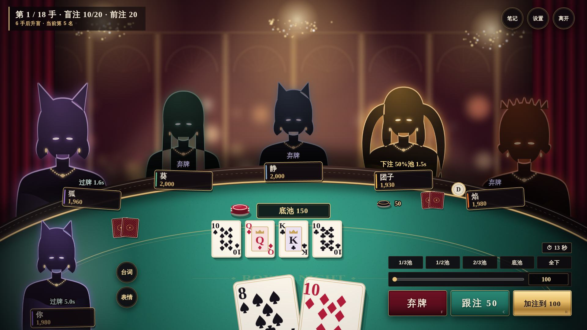

# 10 · 美术方向 v2：「皇家之夜」

> 定位：**上 Steam，对标雀魂**。不走可爱休闲，走**精致、奢靡、性感的成人向二次元**——深夜会员制赌场，丝绒、黄金、水晶灯，牌桌上坐着危险又迷人的女人。
> 本文取代 [07](07-art-direction.md) 里的"暖光赌场厚涂"方向（07 的构图分析、2D 分层和第一人称牌桌结论仍然有效）。
> 素材路径和热插拔规范见 [08 第 6 节](08-presentation.md)。



*现在的牌桌（全部代码绘制，没有外部素材）。人物还是剪影占位，等 AI 立绘到位后直接替换。*

## 1. 一句话风格

**"深夜的私人牌局"**：暗、贵、近。画面的大部分是深酒红和黑，光只打在三个地方——牌桌、人物、筹码。所有装饰都是金色，所有高光都是暖的。

| 不要 | 要 |
|---|---|
| 明亮、高饱和、粉嫩、Q 版 | 暗场、低饱和、深色里的金色高光 |
| 圆润的卡通 UI、彩色描边大字 | 细金线、双线边框、衬线字体、克制的留白 |
| 满屏都亮 | 一束光打在主角身上，其他地方沉进黑暗 |
| 校服、学生、萝莉体型 | 明确的成年女性：晚礼服、丝绒、蕾丝、珠宝 |

## 2. 色板

代码里的定义在 `web/src/stage/painter.ts` 的 `PAL` 和 `web/src/style.css` 的 `:root`。

| 名称 | 色值 | 用在哪 | 面积 |
|---|---|---|---|
| 夜 night | `#0a0408` | 底色、阴影（**阴影不用纯黑**，带一点紫红） | 约 45% |
| 酒红 wine | `#3a0d18` | 墙面、幕布、面板 | 约 25% |
| 祖母绿 felt | `#17574b` → `#2f8f7a` | 牌桌（唯一的冷色，视线中心） | 约 15% |
| 金 gold | `#e8c27a`（亮 `#ffe3a3`、暗 `#8a6a2f`） | 线条、边框、文字、珠宝 | 约 5%，**少而亮** |
| 绯红 crimson | `#b81d3c` | 弃牌、ALL IN、牌背、重要警示 | 点缀 |
| 象牙 ivory | `#f6ecd9` | 牌面、正文 | 点缀 |
| 角色主色 | 每人一个 | 轮廓光、名牌色条、切入画面的底色 | 点缀 |

**规则**：金色只用来"描边"和"点亮"，不用来大面积铺色，否则会变廉价。角色主色只出现在轮廓光和小色条上。

## 3. 光

- **主光**：头顶水晶灯，暖金色，从上往下。牌桌中央最亮（一圈聚光），向四周暗下去。
- **轮廓光**：每个角色背后一道主色的边缘光，让人物从暗背景里"浮"出来。这是性感感的关键——曲线靠光勾出来，不靠露。
- **背景**：虚化的光斑（bokeh）、金色壁柱和拱门、丝绒幕布，全部压暗。
- **后期**：轻微对比度和饱和度提升、胶片颗粒、四角暗角（`web/src/fx/post.ts`）。

## 4. 界面

- **字体**：标题和中文用 **思源宋体（Noto Serif SC）** 粗体；数字和英文用 **Cinzel**（罗马碑刻体，奢侈品牌常用）；毛笔字（马善政）只留给"本局主役"、"葫芦"这类大字。
- **面板**：深色半透明玻璃 + 1px 金线 + 内侧第二道细金线；对话框四角有金色折角。
- **按钮**：弃牌绯红、跟注祖母绿、加注金色，表面有金属渐变和扫光。
- **牌**：象牙牌面、细金内框；人头牌有金框和皇冠；牌背是绯红漆面 + 金色菱格 + 中央徽章。
- **筹码**：黑金、绯红象牙、象牙绯红、紫金四种，带厚度和投影。
- **大时刻**（ALL IN、VS、BLUFF!、本局主役）：深色漆面横幅 + 角色色调 + 金色边线，大字用金色填充、深酒红描边。

## 5. 角色：性感但安全

性感是核心卖点，但 Steam 审核、年龄分级、以后进其他平台都要考虑。**原则：靠气质、姿态、光影和服装剪裁出效果，不靠裸露。**

### 硬性要求

1. **所有角色明确是成年人**：设定年龄 23 岁以上，成年女性的身材比例和面部，场景是成人赌场。不用校服、书包、童装元素，不画幼态的体型和脸。这一条没有商量余地——它决定能不能上架，也是底线。
2. **不露点、不画性行为**。深 V、露背、高开衩、丝袜、吊带袜、兔女郎式荷官服都可以；内衣外露和走光镜头不做。
3. **不出现真钱**：没有钞票、没有货币符号（见 [01](01-market-research.md)）。

### 怎么做出"血脉喷张"

| 手段 | 例子 |
|---|---|
| **剪裁** | 露背晚礼服、侧开衩到大腿、一字肩、深 V、紧身缎面、长手套 |
| **材质** | 丝绒、缎面高光、黑色蕾丝、透纱袖、丝袜光泽、珠宝反光 |
| **姿态** | 侧身回眸、托腮、手指绕发、倚着牌桌俯身、指尖夹筹码、叠腿 |
| **表情** | 半闭眼、挑眉、咬唇、居高临下的微笑；输了是不甘而不是哭哭啼啼 |
| **光** | 轮廓光勾锁骨、肩线和腰线；脸一半在阴影里 |
| **演出** | 赢的时候站起来、撩头发；ALL IN 切入时的眼神特写；本局主役的胜利全身立绘是全游戏最"杀"的一张 |

### 六个角色的造型方向

剪影已经在游戏里（发型对应 `web/src/stage/assets.ts` 的 `HAIR`），立绘要和剪影一致，缩成头像也能认出来。

| 角色 | 性格 | 主色 | 造型方向 |
|---|---|---|---|
| 凛 | 紧凶型 | 绯红 | 黑长直、冷艳。绯红露背缎面长裙、黑色长手套、红唇。像拍卖行的女主人，目光像在估价 |
| 团子 | 跟注站 | 琥珀金 | 双马尾、慵懒丰满。金色吊带缎裙、毛绒披肩滑到臂弯、手里总有一杯香槟 |
| 焰 | 疯狂型 | 橙 | 炸毛短发、野。橙黑皮衣 + 网袜、锁骨纹身、耳骨链。赢了会踩上椅子 |
| 静 | 岩石型 | 冰蓝 | 波波头、禁欲系。高领无袖旗袍式长裙、细框眼镜、珍珠。最不露，反而最勾人 |
| 葵 | 平衡型 | 祖母绿 | 长发、优雅。祖母绿丝绒一字肩礼服、翡翠耳坠，像这家赌场真正的主人 |
| 狐 | 诈唬型 | 紫 | 狐耳、狡黠。紫色高开衩旗袍、黑丝、折扇半遮脸，说谎时笑得最甜 |

## 6. 用 AI 出图

### 选工具

| 工具 | 适合 | 注意 |
|---|---|---|
| **NovelAI**（V4 以上动漫模型） | 二次元立绘质量高、标签控制精确、出图快 | 订阅制；生成图可商用（以出图时的服务条款为准） |
| **Midjourney / Niji** | 氛围、光影、场景背景 | 角色一致性弱；付费档才能商用 |
| **SDXL 系社区模型**（Illustrious、Pony 等衍生） + ComfyUI | 可以训练角色 LoRA，一致性最好，可控性最强 | **每个模型的许可证不同，有些禁止商用，用之前逐个确认** |

建议：**场景和氛围用 Niji，角色用 NovelAI 起稿 → SDXL 训练 LoRA 批量出表情**。

### 提示词模板（英文标签）

**角色立绘**（以凛为例，换掉中间的造型词就是其他人）：

```
masterpiece, best quality, 1girl, solo, mature female, adult woman, 25 years old,
half body, from side, looking back at viewer, half-lidded eyes, smirk, red lips,
long straight black hair, crimson backless satin evening gown, long black opera gloves,
gold jewelry, diamond earrings, bare shoulders, elegant, seductive,
luxury casino at night, holding poker chip between fingers,
dramatic lighting, rim light, warm golden key light from above, dark background, bokeh,
deep shadows, glossy satin, cinematic, anime coloring, detailed
```

**负面词**：

```
loli, child, young, school uniform, petite, flat chest, chibi,
nude, nipples, underwear, panties,
money, banknote, dollar sign, cash,
text, watermark, signature, logo,
bright background, pastel, low quality, bad hands, extra fingers
```

`mature female`、`adult woman` 和负面词里的 `loli, child, young, school uniform` **每张图都必须带**。

**透明背景**：先出纯色背景（`simple background, black background`），再用抠图工具（rembg、Photoshop 主体选择）去背景，边缘的轮廓光要保留。

**场景背景**（Niji）：

```
interior of an exclusive private casino at night, art deco, crimson velvet curtains,
gold pilasters and arches, crystal chandeliers, warm bokeh, empty, no people,
dark moody lighting, anime background art, wide shot, 16:9 --niji 6 --ar 16:9
```

### 保持画风统一的流程

1. **定一张"风格锚"**：先反复出图，选出一张最满意的，记下模型、采样器、步数、CFG、种子、全部提示词。之后所有角色都用同一套风格词。
2. **每个角色出设定稿**：正面、侧面、背面三视图 + 表情表（平常、得意、紧张、生气、震惊、不甘）。设定稿定了再出正式素材。
3. **训练角色 LoRA**：每个角色挑 20–40 张一致性最好的图训练 LoRA，之后的表情、姿态都用 LoRA 出，长相不会漂。
4. **固定姿态**：同一个角色的 4 个半身表情用同一张姿态参考（ControlNet OpenPose 或线稿），只换表情和手势，这样在牌桌上切换表情时人不会"跳"。
5. **人工修图**：AI 图一定要过一遍人工——手指、珠宝、服装接缝、左右对称的饰品、眼睛高光。建议找一位画师按张计费做修图和统一色调（贴合本文的色板：阴影偏酒红、高光偏金）。
6. **留档**：每张最终素材记录提示词、种子、模型版本和修图记录，放在 `docs/art/prompts/`。以后补新表情、做皮肤都靠它；版权和审核问起来也有据可查。

### 素材规格（摘自 08 第 6 节）

| 素材 | 规格 |
|---|---|
| 半身立绘：idle、smug、nervous、angry、shock、cry | 1200×1600 PNG，透明背景，腰部以上，头顶留 8% 空白 |
| 胜利全身：win | 1600×2000 PNG，透明背景 |
| ALL IN 切入：cutin（可选） | 1200×1600，眼神特写感，可以裁得更近 |
| 表情包 × 8 | 512×512 PNG |
| 牌桌场景三层、大厅 | 3840×2160 |

放进 `web/public/art/characters/<角色ID>/` 就会自动替换剪影，不用改代码。

## 7. Steam 上架相关

以下是写这份文档时的理解，**提交前要按 Steamworks 当时的文档再核对一遍**。

- **成人内容问卷**：上架时要填内容问卷（暴力、裸露或性内容、成人内容等）。按本文的尺度（性感服装、无裸露），目标是只勾"一般成人内容"或"部分裸露或性内容"里最轻的一档，**不碰"仅限成人的性内容"**——那一档默认对大多数用户隐藏，商店曝光会大幅下降。
- **AI 内容披露**：Steam 要求开发者披露游戏里预先生成的 AI 内容（立绘、背景），并保证不侵权、不违法。披露内容会显示在商店页。我们的 AI 对手是规则算法，不是实时生成内容的大模型，不涉及"实时生成"那一项。
- **模拟赌博**：游戏里没有真钱、筹码不能兑现、不能交易，属于"模拟赌博"类，Steam 允许；但部分地区的年龄分级会因此提高（如韩国、部分欧洲国家），发行前按地区确认。
- **商店素材**：胶囊图、主视觉同样要遵守问卷尺度。商店页的图是所有用户都能看到的，**尺度要比游戏内更保守**。
- **版权**：纯 AI 生成的图在一些国家和地区可能得不到著作权保护；人工修图、重绘越多，权利越稳。参考图（带签名的那张）只用来定方向，不用、不描。

## 8. 中国市场备注

- Steam 在中国大陆能访问，上 Steam 本身不需要版号；但如果以后上国内平台（TapTap、应用商店等），需要版号，而棋牌类基本不发（见 [01](01-market-research.md)），国内平台的服装尺度也更严。
- 国内有 AI 生成内容标识的规定（2025 年起施行），主要针对生成服务和传播平台。正式发行前确认游戏内是否需要标注。

## 9. 已经完成的（美术 A 线：代码绘制，无外部素材）

| 部分 | 内容 |
|---|---|
| 场景 | 酒红墙面、金色壁柱和拱门、水晶灯、丝绒幕布、光斑、顶光光柱 |
| 牌桌 | 皮革桌沿、金色嵌线、聚光的祖母绿桌面、双金线下注线、"ROYAL NIGHT"桌徽 |
| 人物占位 | 剪影 + 角色色轮廓光 + 发光的眼睛 + 金项链和耳坠，缎面礼服的光泽 |
| 牌和筹码 | 象牙牌面、标准点数排布、人头牌金框皇冠、绯红漆面牌背；四色 3D 筹码 |
| 界面 | 深色玻璃 + 金线全套重做：按钮、名牌、底池、计时、对话框、主页、结算 |
| 大时刻 | ALL IN、VS、混战、BLUFF!、本局主役、胜率条全部换成深色漆面 + 金线 |
| 字体 | 思源宋体 + Cinzel |

## 10. 下一步

1. **B 线：AI 立绘**（你来出图）。先做一个角色（建议凛或狐）的全套 7 张，放进游戏看效果，再铺开另外 5 个。
2. **场景背景**：用 Niji 出三层场景替换代码绘制的大厅，层次和细节会再上一个台阶。
3. **Live2D**（以后）：雀魂的立绘会呼吸、眨眼、晃动。等静态立绘定稿后再评估，成本主要在建模。
4. **牌背和桌布皮肤**：最适合做成可收集的外观，也是以后的收入点。
